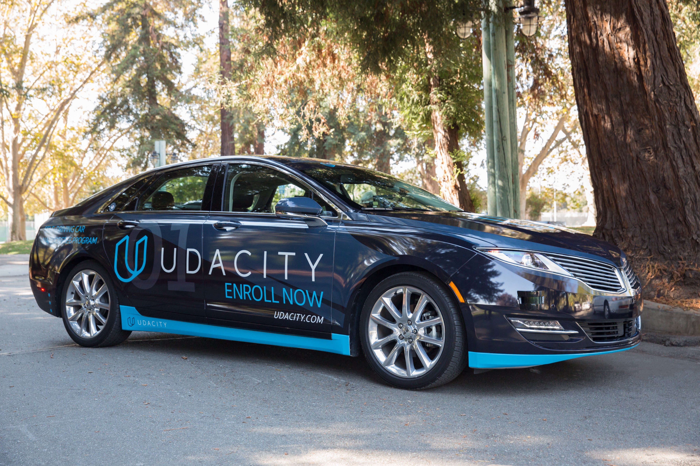
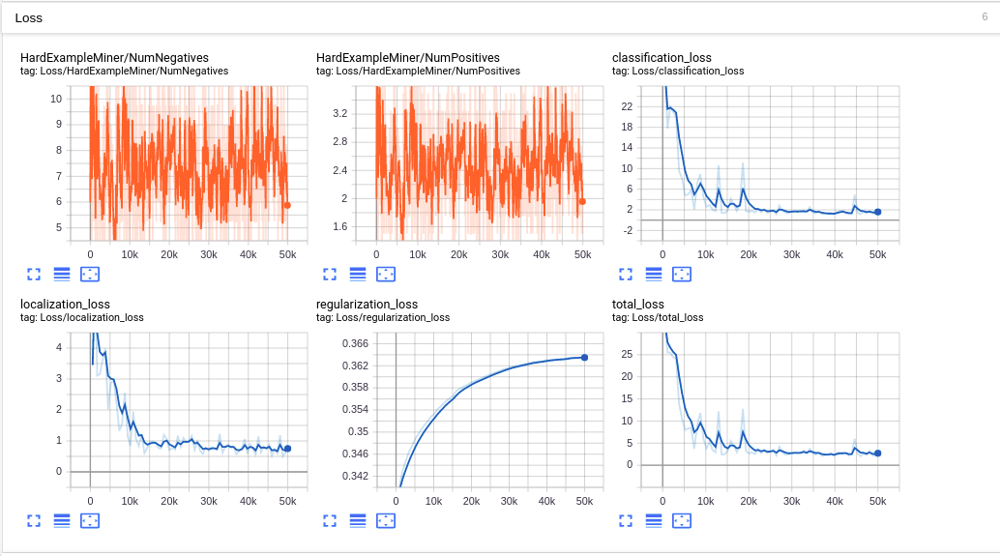
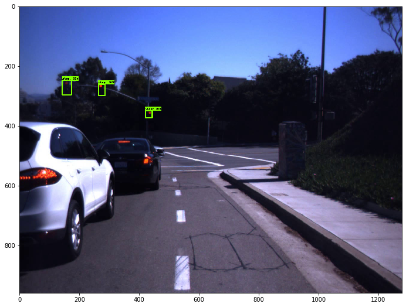
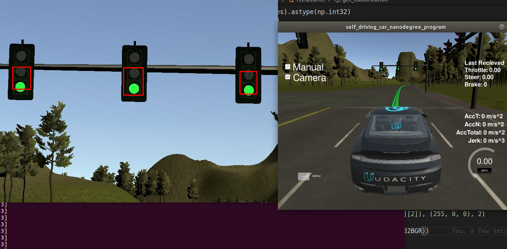
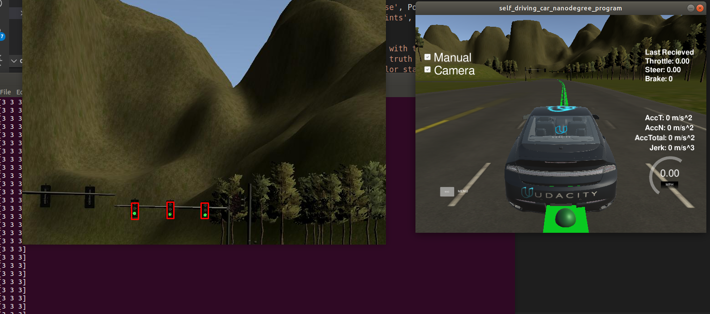

# Self-Driving Car System Integration
---

This is my project repo for the Capstone project of the **Udacity Self-Driving Car Engineer Nano-degree**. For the installation and environment setup, please refer to the Appendix of this README or [this link](https://github.com/udacity/CarND-Capstone).

In this project, I implemented a Traffic Light Detection/Classification module to detect and classify the color of traffic lights in video stream, a Waypoint Updater module that updates the planned path trajectory for the vehicle, and a Waypoint Follower module that controls the vehicle to follow the planned path. After that, all these modules are integrated in a ROS environment. Finally, the framework is tested in simulation and will be tested in real world.

Below is a graph of the system architecture of my Self-Driving system:


---
A screenshot of simulator for system verification:


---
Udacity Carla vehicle to test my system:



---
In the following sessions, I will introduce how I implemented this system step by step, following the actual sequence of my implementation.


## 1. Start with Waypoint Updater node

There are many ways to start with. I started by implementing a partially working **[Waypoint Updater Node](ros/src/waypoint_updater)** because to simply get the car moving is a big step, and also a good start. And to get the car moving, we need the car to follow some waypoints. To do this, we need to have the waypoints first.

The goal of this step is simply to publish a list of waypoints to the topic `/final_waypoints`. To achieve this, we need to subscribe to the topics `/base_waypoints`, which publishes the list of all waypoints of the track, and `/current_pose` which contains the current position of vehicle. This position can be used to calculate the **closest waypoint** on the track, and we can output a list of waypoints based on that.

After this step is done, we can check by looking into the message by echoing `/final_waypoints`, or turning on the simulator where the waypoints will be visualized.


## 2. Drive-By-Wire Node

After having the waypoints to follow, we need to program the car to actually follow those points. This is done by two steps: 1.generate control commands for each individual waypoint, and 2.control the vehicle by acceleration/braking/steering at each waypoint. The step one is actually done in the Waypoint Follower Node, which was implemented based on a **_pure persuit module_**. For step 2, I implemented the yaw and speed controllers, which are based on PID controller in the **[twist controller node](ros/src/twist_controller)**.

This node is actually implemented in [dbw_node.py](ros/src/twist_controller/dbw_node.py), which scribes to `/current_velocity`, `/twist_cmd` and `/vehicle/dbw_enabled` topics, and publishes throttle, brake and steer commands, the controllers are implemented in [twist_controller.py](ros/src/twist_controller/twist_controller.py).

The DriveByWire Node will publish steering, throttle and brake commands at 50 hz.

Once this node is working, the car will be able to follow the `/final_waypoints` in the simulator.


## 3.Traffic Light Detection Node

Once the vehicle is able to process waypoints, generate steering and throttle commands, and traverse the course, it will also need stop for obstacles, for example, traffic lights.

This node is implemented [here](ros/src/tl_detector). The [node script](ros/src/tl_detector/tl_detector.py) subscribes to four topics:
    `/base_waypoints`: provides the complete list of waypoints for the course.
    `/current_pose`: can be used to determine the vehicle's location.
    `/image_color`: which provides an image stream from the car's camera. These images are used to determine the color of upcoming traffic lights.
    `/vehicle/traffic_lights`: provides the (x, y, z) coordinates of all traffic lights.

This node should publish the index of the waypoint for nearest upcoming red light's stop line to a single topic: `/traffic_waypoint`, which is the index of an upcoming red light's stop line in the complete list of waypoints. This index can later be used by the waypoint updater node to set the target velocity for that waypoint to 0 and smoothly decrease the vehicle velocity in the waypoints leading up to that waypoint.

Then the task for this node can be broken into two steps:

1. Use the vehicle's location and the (x, y) coordinates for traffic lights to find the nearest visible traffic light ahead of the vehicle. This takes place in the `process_traffic_lights` method of _tl_detector.py_. We can use the `get_closest_waypoint` method to find the closest waypoints to the vehicle and lights. Using these waypoint indices, we can determine which light is ahead of the vehicle along the list of waypoints.

2. Use the camera image data to classify the color of the traffic light. The core functionality of this step takes place in the `get_light_state method` of tl_detector.py. There are a number of approaches for this task. One of the simpler approaches is to train a deep learning classifier to classify the entire image as containing either a red light, yellow light, green light, or no light. This is acually the approach that I took. One resource that's already available is the traffic light's position in 3D space via the `vehicle/traffic_lights` topic.

**For step 2, I took a pre-trained SSD-MobileNet model and performed transfer learning on it**, the entire process is explained below:

#### Install the environment

First, install the [Tensorflow Object Detection API](https://github.com/tensorflow/models/tree/master/research/object_detection) by downloading or cloning. Following the official instructions, the installation can be done fairly easily.

#### Find a image dataset

I used the [LISA Traffic Light Dataset](https://www.kaggle.com/mbornoe/lisa-traffic-light-dataset) provided by Kaggle. However, there are other datasets that we can use, such as [Bosch small traffic lights dataset](https://hci.iwr.uni-heidelberg.de/node/6132). Also, having a pre-labeled dataset will save tons of time. Otherwise I will need to label them by hand. This can also be done but it's out of this project's scope.

To use my own dataset in Tensorflow Object Detection API, I converted it
into the [TFRecord file format](https://www.tensorflow.org/api_guides/python/python_io#tfrecords_format_details).

You can visit this [document](https://github.com/tensorflow/models/blob/master/research/object_detection/g3doc/using_your_own_dataset.md) to see how to write a script to generate the TFRecord file.


#### Dataset Requirements

##### Images and Annotations

For every example in the dataset, I should have the following information:

1. An RGB image for the dataset encoded as jpeg or png.
2. A list of bounding boxes for the image. Each bounding box should contain:
    1. A bounding box coordinates (with origin in top left corner) defined by 4
       floating point numbers [ymin, xmin, ymax, xmax]. Note that we store the
       _normalized_ coordinates (x / width, y / height) in the TFRecord dataset.
    2. The class of the object in the bounding box.

I used the LISA dataset which comes with annotations in CSV format.

##### Label Maps

Each dataset is required to have a label map associated with it. This label map
defines a mapping from string class names to integer class Ids. The label map
should be a `StringIntLabelMap` text protobuf. Sample label maps can be found in
object_detection/data. Label maps should always start from id 1.

I wrote my own [label map](data/lisa_label_map.pbtxt) for the selected portion of LISA dataset.


#### TF Record files preparation

With the LISA dataset images and annotation CSVs, first I need to generate tfrecords for training and testing. Since I'm only using about 300 images selected from LISA, I didn't put them into separate record files or shuffle them. Instead, I split them into `train` and `test` folders, and seleted the annotation CSV corresponding rows. This can be found in [here](data/trainAnnotationsBOX.csv).

Then, with [this script](scripts/generate_tfrecord.py), we can generate the tfrecord files for train and test datasets. The tensorflow API has [instructions](https://github.com/tensorflow/models/blob/master/research/object_detection/g3doc/using_your_own_dataset.md) of how to generate tfrecords off your own dataset. I used a opensource script written by [datitran](https://github.com/datitran/raccoon_dataset) to generate tfrecords from LISA images and [selected annotation CSV files](data/trainAnnotationsBOX.csv). To generate your own tfrecords, you will need to modify some of the PATHs in the bash command that calls this python script:

```python
  # Create train data:
  python3 generate_tfrecord.py --csv_input=data/trainAnnotationsBOX.csv --output_path=data/train.record --image_dir=train
  # Create test data:
  python3 generate_tfrecord.py --csv_input=data/testAnnotationsBOX.csv  --output_path=data/test.record --image_dir=test
```

The generated tfrecord files can be found [here](data/).

#### Pipeline Config File

Now that the TF record files are ready, the label map text is ready, are we ready to train a pre-trained model by transfer learning? Not quite. First, we need to first download a pre-trained model such as SSD-MobileNet-COCO from the [TF Model Zoo](https://github.com/tensorflow/models/blob/master/research/object_detection/g3doc/detection_model_zoo.md). And we need to get a sample pipeline config file like [this one](data/ssd_mobilenet_v1_coco.config), they can be found in [Tensorflow API](https://github.com/tensorflow/models/tree/master/research/object_detection/samples/configs) as well.

After obtaining a config file, I modified it according to my training needs. For example, the `num_classes` should be modified from 90 to 4, which is my class number, which are `stop`, `warning`, `go` and `warningLeft`.
```
model {
  ssd {
    num_classes: 4
    box_coder {
      faster_rcnn_box_coder {
        y_scale: 10.0
        x_scale: 10.0
        height_scale: 5.0
        width_scale: 5.0
      }
    }
```
The last part of the config file should also be modified according to my own TF record files and label map:
```
train_input_reader: {
  tf_record_input_reader {
    input_path: "data/train.record"
  }
  label_map_path: "data/lisa_label_map.pbtxt"
}

eval_config: {
  num_examples: 2000
  # Note: The below line limits the evaluation process to 10 evaluations.
  # Remove the below line to evaluate indefinitely.
  max_evals: 10
}

eval_input_reader: {
  tf_record_input_reader {
    input_path: "data/test.record"
  }
  label_map_path: "data/lisa_label_map.pbtxt"
  shuffle: false
  num_readers: 1
}
```

#### Transfer Learning

I selected the SSD Mobilenet V1 COCO as my baseline model for transfer learning. Again, this model can be found in [TF Model Zoo](https://github.com/tensorflow/models/blob/master/research/object_detection/g3doc/detection_model_zoo.md). The learning is done in the installed Tensorflow Object Detection API directory, with [this script](scripts/model_main.py) that comes with installation. **Notice: the following bash command shall be run in the terminal to run the script.**

```
python3 model_main.py \
    --pipeline_config_path=${PIPELINE_CONFIG_PATH} \
    --model_dir=${MODEL_DIR} \
    --num_train_steps=${NUM_TRAIN_STEPS} \
    --sample_1_of_n_eval_examples=$SAMPLE_1_OF_N_EVAL_EXAMPLES \
    --alsologtostderr
```

where the variables inside {} must be specified based on your own setting. In my case, they are:

```
PIPELINE_CONFIG_PATH=training/ssd_mobilenet_v1_coco.config
MODEL_DIR=ssd_mobilenet_v1_coco_11_06_2017
NUM_TRAIN_STEPS=50000
SAMPLE_1_OF_N_EVAL_EXAMPLES=1
```

The training took me about 12 hours on a ThinkPad P50, with the training set being about 270 images.

Some of the statistics of the training can be viewed by TensorBoard, such as loss:




#### Test

After training is done, we need to export the frozen model graph out of the training results. This can be done with [this script](scripts/export_inference_graph.py) that comes with the installation.

Then we can proceed to test the model.

The test is also done in the Tensorflow Object Detection API directory, with this [jupyter notebook](scripts/test_obj_detection.ipynb). some of the test results look like this:




### Deploy in the Traffic Light Detection Node

The model is enventually deployed in the the **Traffic Light Detection Node**, in [_tl_classifier.py_](ros/src/tl_detector/light_classification/tl_classifier.py).


## 4. Test in Simulation

To test the system, I ran the system with the simulator provided by Udacity. Because my laptop doesn't have a GPU, I experienced a huge delay when I turned on the camera. However, I was still able to verify that my traffic light detector does detect traffic lights:

Detection of close distance:



Detection of far distance:



## 5. TODO list

    1. Deploy the system in Carla simulator to test with more complicated traffic scenarios.
    2. Train the ssd mobilenet model to detect vehicles and traffic lights.
    3. Develop object distance calculation and tracking algorithms using detection results of the Deep Learning model.

## Appendix

This is the project repo for the final project of the Udacity Self-Driving Car Nanodegree: Programming a Real Self-Driving Car. For more information about the project, see the project introduction [here](https://classroom.udacity.com/nanodegrees/nd013/parts/6047fe34-d93c-4f50-8336-b70ef10cb4b2/modules/e1a23b06-329a-4684-a717-ad476f0d8dff/lessons/462c933d-9f24-42d3-8bdc-a08a5fc866e4/concepts/5ab4b122-83e6-436d-850f-9f4d26627fd9).

Please use **one** of the two installation options, either native **or** docker installation.

### Native Installation

* Be sure that your workstation is running Ubuntu 16.04 Xenial Xerus or Ubuntu 14.04 Trusty Tahir. [Ubuntu downloads can be found here](https://www.ubuntu.com/download/desktop).
* If using a Virtual Machine to install Ubuntu, use the following configuration as minimum:
  * 2 CPU
  * 2 GB system memory
  * 25 GB of free hard drive space

  The Udacity provided virtual machine has ROS and Dataspeed DBW already installed, so you can skip the next two steps if you are using this.

* Follow these instructions to install ROS
  * [ROS Kinetic](http://wiki.ros.org/kinetic/Installation/Ubuntu) if you have Ubuntu 16.04.
  * [ROS Indigo](http://wiki.ros.org/indigo/Installation/Ubuntu) if you have Ubuntu 14.04.
* [Dataspeed DBW](https://bitbucket.org/DataspeedInc/dbw_mkz_ros)
  * Use this option to install the SDK on a workstation that already has ROS installed: [One Line SDK Install (binary)](https://bitbucket.org/DataspeedInc/dbw_mkz_ros/src/81e63fcc335d7b64139d7482017d6a97b405e250/ROS_SETUP.md?fileviewer=file-view-default)
* Download the [Udacity Simulator](https://github.com/udacity/CarND-Capstone/releases).

### Docker Installation
[Install Docker](https://docs.docker.com/engine/installation/)

Build the docker container
```bash
docker build . -t capstone
```

Run the docker file
```bash
docker run -p 4567:4567 -v $PWD:/capstone -v /tmp/log:/root/.ros/ --rm -it capstone
```

### Port Forwarding
To set up port forwarding, please refer to the "uWebSocketIO Starter Guide" found in the classroom (see Extended Kalman Filter Project lesson).

### Usage

1. Clone the project repository
```bash
git clone https://github.com/udacity/CarND-Capstone.git
```

2. Install python dependencies
```bash
cd CarND-Capstone
pip install -r requirements.txt
```
3. Make and run styx
```bash
cd ros
catkin_make
source devel/setup.sh
roslaunch launch/styx.launch
```
4. Run the simulator

### Real world testing
1. Download [training bag](https://s3-us-west-1.amazonaws.com/udacity-selfdrivingcar/traffic_light_bag_file.zip) that was recorded on the Udacity self-driving car.
2. Unzip the file
```bash
unzip traffic_light_bag_file.zip
```
3. Play the bag file
```bash
rosbag play -l traffic_light_bag_file/traffic_light_training.bag
```
4. Launch your project in site mode
```bash
cd CarND-Capstone/ros
roslaunch launch/site.launch
```
5. Confirm that traffic light detection works on real life images

### Other library/driver information
Outside of `requirements.txt`, here is information on other driver/library versions used in the simulator and Carla:

Specific to these libraries, the simulator grader and Carla use the following:

|        | Simulator | Carla  |
| :-----------: |:-------------:| :-----:|
| Nvidia driver | 384.130 | 384.130 |
| CUDA | 8.0.61 | 8.0.61 |
| cuDNN | 6.0.21 | 6.0.21 |
| TensorRT | N/A | N/A |
| OpenCV | 3.2.0-dev | 2.4.8 |
| OpenMP | N/A | N/A |

We are working on a fix to line up the OpenCV versions between the two.
